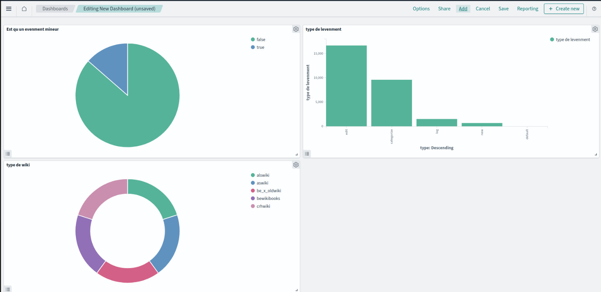

# Wikimedia to OpenSearch via Kafka

This project streams real-time data from Wikimedia using Apache Kafka as the producer and indexes it into OpenSearch. The data is visualized through OpenSearch Dashboards.

## Key Components

- **Kafka Producer**: Streams real-time data from Wikimedia.
- **Kafka Consumer**: Processes data and sends it to OpenSearch.
- **OpenSearch Dashboards**: Provides visual insights into the indexed data.

## Dashboard Preview

